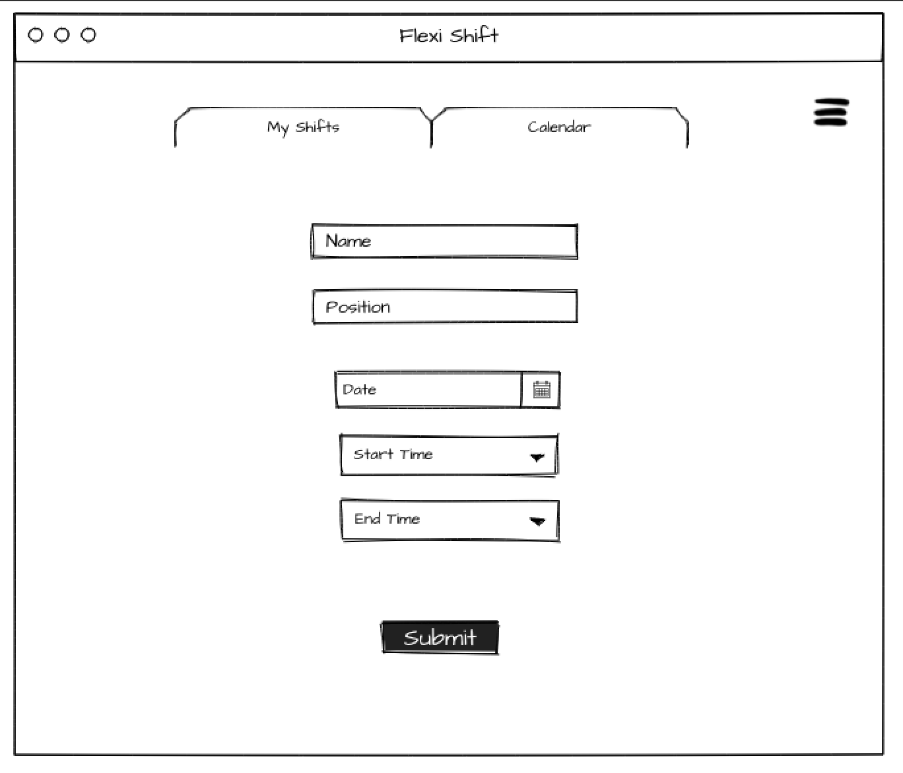
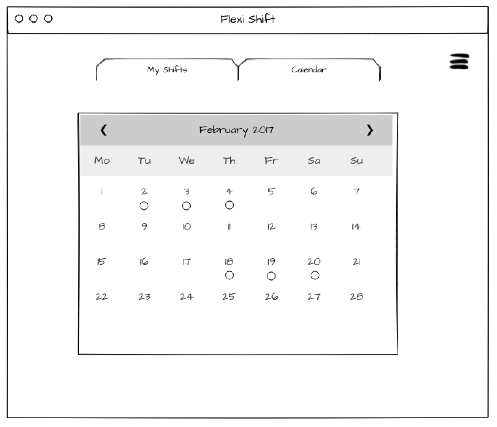
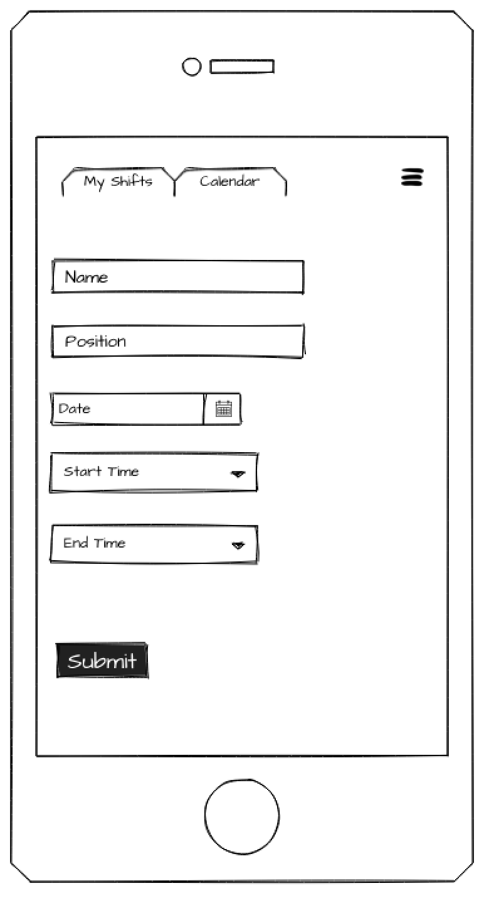

# FLEXI SHIFT 
**Project By:** Susie Gordon

## Description
Flexi Shift is an app that conveniently helps employers and employees schedule individual work shifts. Users can view their manually added list of shifts and the calendar month of choice displaying all other reserved shifts added by supervisors, colleagues, or coworkers. 

## Links
- [**Github**](https://github.com/choisus08/project_4_frontend)
- [**Deployment**](https://project-4-frontend-tau.vercel.app/)
- [**Trello**](https://trello.com/b/SYwaLdsk/flexi-shift)
 

## Technologies Used
- Django
- Google Fonts
- Postman
- Python
 

## Installation
- `Fork` and `clone` this respository
- `cd` into the directory on your local machine
- Open this repository in your code editor and run the code `npm start` to open the React app in your browser
 

## Mockup of UI  
Desktop View 
 
 
 
Mobile View 
 